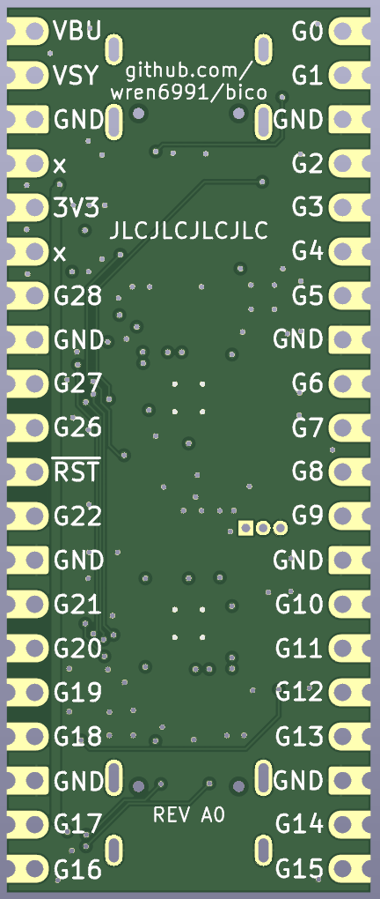

# Bico

A Pico-shaped board with two RP2040s and two USB sockets. One of the RP2040s does everything you would normally expect from a Pico, and th other one provides a debug probe interface for the second. SWD and UART are connected directly between the two RP2040s on-board, so there are no flying wires required.

The board can be powered from either USB socket. One socket provides USB access to the main RP2040, and the other one provides debug and serial access via the probe RP2040. You can plug in both at the same time, though ideally on the same machine as this will short the grounds and shields of the two USB cables together.

Schematic is [here](board/bico.pdf) (PDF link)

License: CC0
